<h1>Hi 👋, I'm Naveen Kumar</h1>

<picture>
  <source media="(prefers-color-scheme: dark)" srcset="./dark.svg">
  <source media="(prefers-color-scheme: light)" srcset="./light.svg">
  
</picture>

---

  <b>AI Engineer · Full-Stack Engineer · Backend Systems · AI & SaaS Builder</b>

  🤖 AI / LLMs &nbsp;·&nbsp; 🐍 Python &nbsp;·&nbsp; ⚡ AWS Lambda &nbsp;·&nbsp; ⚛️ React / Next.js
  &nbsp;·&nbsp; ⚙️ Node.js &nbsp;·&nbsp; ☁️ AWS &nbsp;·&nbsp; 🧠 System Design

I build **AI-powered products, scalable backend systems, SaaS platforms, automation workflows, and production web applications**.

My current engineering interests sit at the intersection of **AI/LLMs, Python, serverless systems, full-stack development, backend architecture, and developer automation**.

---

## 🤖 What I Build

- 🧠 **AI / LLM applications** — LLM integrations, AI workflows and intelligent product features
- 🐍 **Python systems** — APIs, automation, AI services and backend tooling
- ⚡ **AI bots & serverless workflows** — AWS Lambda-powered automation and AI processing
- 🚀 **SaaS products** — multi-user applications, dashboards, payments and product infrastructure
- ⚙️ **Backend systems** — APIs, async processing, caching, real-time systems and integrations
- ⚛️ **Full-stack applications** — React, Next.js, Node.js and TypeScript
- 📈 **Performance & scalability** — production optimization, high-volume processing and system design

---

## 🛠️ Engineering Stack

### 🤖 AI / Machine Learning

### ⚛️ Frontend

### 🧩 State Management & Frontend Tools

### ⚙️ Backend

### 🗄️ Databases

### ☁️ Cloud / DevOps

### 🧠 Architecture

### 🎨 Design & Development Tools

## 📊 GitHub Activity

  

<h2 align="center">Contribution Activity</h2>

  <picture>
    <source
      media="(prefers-color-scheme: dark)"
      srcset="https://raw.githubusercontent.com/naveenjangid178/github-snake/output/github-snake-dark.svg"
    />
    <source
      media="(prefers-color-scheme: light)"
      srcset="https://raw.githubusercontent.com/naveenjangid178/github-snake/output/github-snake.svg"
    />
    
  </picture>

---

## 📫 Connect With Me

**Build things. Automate the boring parts. Scale what matters.**